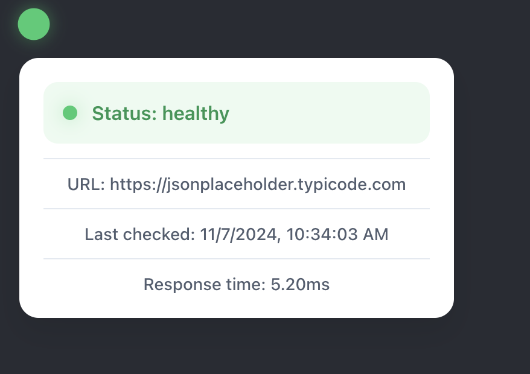

# React Health Checker

A React component library for monitoring and displaying system health status. Features include customizable health checks, retry logic, response time monitoring, and an accessible UI with developer tools. Built with TypeScript and styled-components.



## Installation

```bash
npm install react-health-checker
```

## Usage

```tsx
import { HealthCheck } from 'react-health-checker';
``` 

Then use the component in your React application:

```tsx
<HealthCheck url="YOUR_URL_CHECKER_API" />
```


## Props

| Prop                  | Type     | Default                                                                                | Description                                                                                |
|-----------------------|----------|----------------------------------------------------------------------------------------|--------------------------------------------------------------------------------------------|
| url                   | string   | required                                                                               | The URL endpoint to check for health status                                                |
| interval              | number   | 30000                                                                                  | Time in milliseconds between health checks                                                 |
| enabled               | boolean  | true                                                                                   | Whether the health check is active                                                         |
| messages              | object   | ```{ healthy: 'Status: healthy', unhealthy: 'Status: unhealthy', loading: 'Status: loading' }``` | Custom messages for each status                                                            |
| onHealthy             | function | undefined                                                                              | Callback function called when health check succeeds, receives axios response               |
| onUnhealthy          | function | undefined                                                                              | Callback function called when health check fails, receives error or axios response         |
| position              | string   | 'bottom-right'                                                                         | Position of the health indicator on screen                                                 |
| retryAttempts         | number   | 3                                                                                      | Number of retry attempts before marking as unhealthy                                       |
| retryDelay            | number   | 5000                                                                                   | Delay between retry attempts in milliseconds                                               |
| responseTimeThreshold | number   | 1000                                                                                   | Response time threshold in milliseconds. Responses slower than this are marked unhealthy   |
| developerMode         | boolean  | false                                                                                  | Whether to enable developer mode, which logs additional information to the console         |
| indicator             | boolean  | true                                                                                   | Whether to display the health indicator                                                    |


### Position Object

The position prop accepts an object with any of these properties:
- `top-right`: Top right corner
- `top-left`: Top left corner
- `bottom-right`: Bottom right corner  
- `bottom-left`: Bottom left corner

### Messages Object

The messages prop accepts an object with these optional properties:
- `healthy`: string
- `unhealthy`: string  
- `loading`: string

### Developer Mode

When enabled, additional information is logged to the console, including request details and response times.

### Indicator

The indicator prop determines whether the health indicator is displayed.

### Hooks

The library also includes a custom hook for integrating health checks into your application.

```tsx
import { useHealthCheck } from 'react-health-checker';

const healthCheck = useHealthCheck({
  url: 'YOUR_URL_CHECKER_API',
});
```

## Examples

Basic usage:

```tsx
<HealthCheck url="https://your-api.com/health" />
```

Interval:

```tsx
<HealthCheck url="https://your-api.com/health" interval={10000} />
```

Custom messages:

```tsx
<HealthCheck url="https://your-api.com/health" messages={{ healthy: 'API is healthy', unhealthy: 'API is unhealthy', loading: 'Checking API health...' }} />
```

Developer mode:

```tsx
<HealthCheck url="https://your-api.com/health" developerMode />
```

Custom position:

```tsx
<HealthCheck url="https://your-api.com/health" position="top-left" />
```

Custom indicator:

```tsx
<HealthCheck url="https://your-api.com/health" indicator={false} />
```

Response time threshold / retry attempts and retry delay:

```tsx
<HealthCheck url="https://your-api.com/health" responseTimeThreshold={2000} retryAttempts={5} retryDelay={2000} />
```


## License

This project is licensed under the MIT License. See the [LICENSE](LICENSE) file for details.
